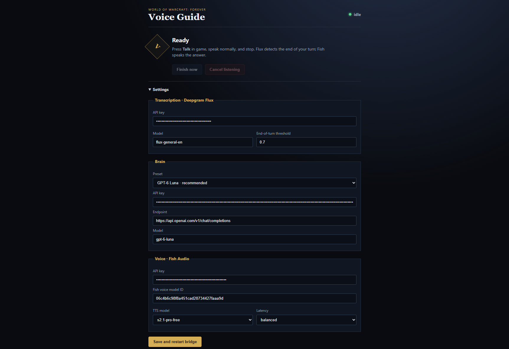

# WoW Voice Guide



**A voice-first player guide for World of Warcraft: Forever.** Press **Talk** (or your bound key) once, ask a question, stop speaking, and hear the answer in a selected Fish Audio voice. Your transcript and the answer also appear in game. You do not need to say “Forever” in every question: the guide treats WoW questions as being about **WoW: Forever** unless you explicitly ask about another version.

This is an MIT-licensed fork of [chelinho139/wow-claude](https://github.com/chelinho139/wow-claude). It retains the original project's game-to-desktop transport and replaces the Claude Code agent with a voice guide powered by your own Deepgram, model-provider, and Fish Audio accounts.

## What it can do today

| Capability | What you can do |
|---|---|
| Hands-free questions | Press the in-game **Talk** button, `/voice`, or a keybind; Deepgram Flux detects when you finish talking. The companion's **Finish now** and **Cancel listening** buttons are fallbacks. |
| Spoken character voices | Hear replies through Fish Audio. Pick Peon, Furbolg, Knight, or Asmongold in the companion, or paste any other Fish Voice Library model ID. Set voice volume from the in-game slider or `/wow-claude volume 0-200`. |
| Character-aware answers | Ask about your current character, level, class, faction, zone, subzone, map position, money, XP, talents, and professions when the Forever client exposes those fields. View or disable what is shared with `/wow-claude context`. |
| Quest help | The add-on sends a compact list of visible quests (up to 25) and, when one is selected or tracked, its objectives and available instructions. Ask where to go, what an objective means, or what to do next. |
| Sourced game lookup | With an OpenAI key and preset, quest and other game-fact questions can trigger live web search. The answer includes cited URLs in game and clickable source buttons in the companion. Search prefers Forever; for familiar places and the same named quest, it can use a matching Classic/Vanilla guide as a clearly labeled reference. It rejects unrelated quests and Retail/expansion results. |
| Item, spell, and quest details | Focus the guide input and shift-click an in-game link; its name and tooltip are attached to your question. This is the precise way to ask “What is this?” about an item or quest. |
| Optional waypoints | When an answer contains a valid, grounded map ID and coordinates, a **Set waypoint** button appears. You choose whether to set it; the guide does not move your character. |
| In-game chat and follow-ups | Type in the window or use `/ai <question>`; `/r` replies to the guide when it was the last messenger. Replies can be echoed into game chat, and multiple conversations, transcript recovery, copyable answers, and a minimizable status bar are retained from the original add-on. |

Try: “Where do I go for my tracked quest?”, “What does this objective mean?”, “What level am I and what quests do I have?”, or “Where can I find Bolvar Fordragon in WoW?” For a specific item or quest, shift-click its link into the guide input before asking.

The guide does **not** see the whole game screen, read every open panel, control movement/combat, or have an authoritative Forever quest database. The desktop companion captures only the add-on's encoded pixel strip to receive messages; screen understanding is not implemented. Live web search can still miss new beta content. A direct Wowhead Forever quest link is a convenience link, not proof that the page was read.

## What runs

There are only two things the player runs:

1. The **WoW Voice Guide add-on** inside the game.
2. One **WoW Voice Guide desktop companion** left open while playing.

The companion talks to three APIs; Deepgram, the brain provider, and Fish Audio are services, not additional programs:

```text
in-game Talk button
  -> desktop microphone
  -> Deepgram Flux transcript + automatic end-of-turn
  -> selected guide model
  -> Fish Audio character voice
  -> speakers + answer in the WoW window
```

WoW add-ons cannot use the network or microphone. That sandbox is why the companion is necessary. Nothing injects into the game, reads game memory, moves the character, or generates player input.

## Models and WoW: Forever accuracy

The shipped default brain preset is **GPT-6 Luna with reasoning disabled**. Other presets are available in companion Settings:

- **GPT-4.1 Mini** — a low-latency fallback with strong instruction following.
- **Gemma 4 26B A4B** through the Gemini API — the Gemma preset I would try first; the mixture-of-experts model is the better latency/quality shape for this use.
- **Gemma 4 31B** through the Gemini API — dense and potentially heavier/slower.
- **Local / other OpenAI-compatible** — LM Studio, llama.cpp, vLLM, or another hosted Chat Completions endpoint.

Both the normal-answer and web-lookup prompts default to **World of Warcraft: Forever**, even when you just say “WoW.” The guide searches Forever first, then can use Classic/Vanilla geography or instructions for the *same* quest as a provisional reference. It labels Classic-based answers because the beta can change routes, NPCs, and objectives. Your current in-game quest ID and objectives take priority when they differ. It does not silently import Retail or expansion guidance. A prompt and web citation cannot guarantee beta accuracy; do not treat an uncited exact waypoint as confirmed. A licensed, version-matched quest database would improve this further.

## Requirements

- Windows and World of Warcraft: Forever, windowed or borderless
- Node.js 22.12 or newer
- API keys for Deepgram and Fish Audio
- One brain-provider key: OpenAI or Google, unless using a local OpenAI-compatible server
- A Fish Audio voice model ID only if you want a voice outside the built-in choices

The example configuration still preselects [Warcraft 3 Peon](https://fish.audio/m/06c4b6c98f8a451cad28734427faaa9d/). The companion also offers [Furbolg (Warcraft 3 ENG)](https://fish.audio/m/fa4d72bfeee64c029970e09aeb67c43e/), [Warcraft 3 Knight](https://fish.audio/m/b31185cef9d54e908c58dfe901e9598b/), and [Asmongold](https://fish.audio/m/fb029f2d4c6c4405bd5b476b536519ae/). These are public Fish model IDs, not API credentials or official endorsements. Fish currently marks the three added models `licensed: false`; confirm your rights to use a voice before publishing generated audio. Community models can also be renamed or removed.

## Install from source (Windows)

You need the Forever beta client, Node.js 22.12+, a Deepgram key for transcription, a Fish Audio key for speech, and a brain-provider key (OpenAI or Google) unless you run a local compatible model. **Automatic web lookup currently requires an OpenAI preset and key**; Google/local presets can still answer ordinary questions. Each provider uses your own account and may charge for usage. The example Fish voice ID is public and is not an API key.

1. Fully close WoW, open PowerShell, and clone/install the project:

   ```powershell
   git clone https://github.com/Griffden/wow-voice-guide.git
   cd wow-voice-guide
   npm install
   node setup.js
   ```

   If setup cannot find your beta client, run `node setup.js --wow "C:\path\to\World of Warcraft\_classic_beta_"`. If it finds the wrong WoW account, pass `--account NAME`. Setup copies the add-on, creates your local `bridge/config.json`, and pre-creates the numbered reply slots. Re-running setup keeps your existing keys/config.

2. Relaunch WoW in **windowed or borderless** mode. At character select, enable **WoW Voice Guide** and leave the numbered `WoWClaude_S###` slot add-ons enabled. A full client restart is needed to discover newly created add-on folders; `/reload` alone is not enough.

3. Start the desktop companion from the project folder and leave it running while you play:

   ```powershell
   npm start
   ```

4. In companion **Settings**, enter your Deepgram API key, select a brain preset and enter that provider's key (OpenAI if you want web lookup), and enter your Fish Audio API key. Choose one of the four built-in Fish voices or paste a custom model ID. Peon remains the initial choice. Click **Save and restart bridge**. Windows may ask for microphone permission on your first Talk request.

5. In game, use `/voice-guide` to open the window and press **Talk**. Speak, then pause; the answer should appear in game and play through Fish. Bind a key in WoW's Key Bindings menu or run `/wow-claude bind F8` (replace `F8` with your preferred key) to ask without reopening the window. `/voice` also starts listening immediately.

For first-run problems, account selection, microphone permissions, and transport diagnostics, see the [detailed Windows guide](docs/INSTALL-WINDOWS.md). Do not commit `bridge/config.json`; it contains your keys and is gitignored.

Typed chat remains available as a fallback. Fish only speaks voice-originated questions by default; set `fish.speakTyped` to `true` in `bridge/config.json` to speak typed answers too. The in-game **Voice volume** slider ranges from 0–200%; values above 100% use companion-side amplification with clipping protection.

### Useful in-game commands

| Command | Use |
|---|---|
| `/voice` | Start one voice question without opening the guide window. |
| `/voice-guide` | Show or hide the guide window. |
| `/ai <question>` | Send a typed question from the regular game chat box. |
| `/r <reply>` | Reply to the guide when it was the last messenger; otherwise WoW's normal whisper reply. |
| `/wow-claude bind F8` | Bind the Talk action to a key; substitute your preferred key. |
| `/wow-claude context` | Show exactly what game context is shared; append `on` or `off` to change it. |
| `/wow-claude volume 150` | Set spoken-reply volume (0–200). |
| `/wow-claude new`, `chat`, `clear`, `copy` | Manage conversations and copy the last answer. |
| `/wow-claude diag`, `slots`, `reload` | Diagnose transport or free used reply slots. |

`/wow-claude help` lists every command. The `WoWClaude` name is retained internally for compatibility with the original transport.

## Important configuration

Secrets may be entered in the companion or supplied as environment variables, which override config:

```text
DEEPGRAM_API_KEY
FISH_API_KEY
WOWVOICE_LLM_API_KEY
GEMINI_API_KEY
```

The default provider block is:

```json
{
  "llm": {
    "provider": "openai-compatible",
    "endpoint": "https://api.openai.com/v1/chat/completions",
    "model": "gpt-6-luna",
    "reasoningEffort": "none"
  }
}
```

See [docs/CONFIGURATION.md](docs/CONFIGURATION.md) for every field and [PLAN.md](PLAN.md) for the researched architecture and delivery decisions.

## How the WoW transport works

The upstream transport solves the add-on sandbox without process injection:

- **Out of WoW:** the add-on draws a checksummed strip of tiny colored cells. A PowerShell helper captures that screen region and decodes the request.
- **Back into WoW:** the bridge writes the answer into one of 200 pre-created load-on-demand slot add-ons. WoW loads a fresh slot and reads the Lua table.
- **Signals:** tiny WAV files provide cheap acknowledgement and readiness signals. Slot polling remains the fallback.

Internal `WoWClaude` folder/global names and legacy `/wow-claude` commands remain for protocol and SavedVariables compatibility. The player-facing product is WoW Voice Guide.

## Verification

```powershell
npm test
```

The suite parses the real Lua, executes the add-on in a Lua VM, round-trips the pixel codec under noise, and tests voice flags, transcript replacement, PCM conversion, structured answers, secret redaction, and waypoint serialization. A real-service smoke test still requires personal provider keys and a running Forever client.

## Current delivery status

This repository is a functioning source prototype and includes Electron packaging configuration. The provider-independent flow is implemented and tested. A signed public installer, store distribution, and hosted proxy for hiding shared production credentials are release work, not prerequisites for running the source build.

Primary service references: [Deepgram Flux](https://developers.deepgram.com/docs/flux/quickstart), [Fish Audio TTS](https://docs.fish.audio/api-reference/endpoint/openapi-v1/text-to-speech), [GPT-6 Luna](https://developers.openai.com/api/docs/models/gpt-6-luna), [GPT-4.1 Mini](https://developers.openai.com/api/docs/models/gpt-4.1-mini), and [Gemma 4 on the Gemini API](https://ai.google.dev/gemma/docs/core/gemma_on_gemini_api).
